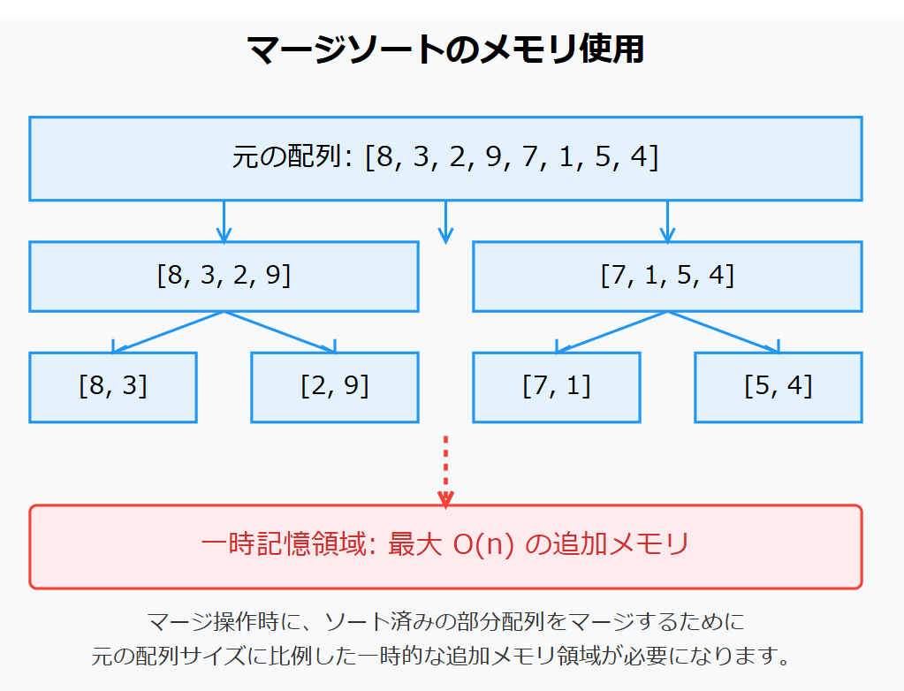

# マージソート(Merge Sort)　O(n log n)
## 概要
「分割統治法」の考え方に基づいたソートアルゴリズム。配列を半分にし、それぞれを再帰的にソートした後、２つのソート済み配列をマージする事で整列を行う.
## 手順
1. 配列を半分に分割する
2. 左半分と右半分をそれぞれ再帰的にマージソートする.
3. ソートされた左半分ト右半分をマージする
- 左右の配列の先頭を比較し、小さい方を結果の配列に追加する.
- 追加した方の配列ポインタを次に進める.
- 片方の配列が空になるまで繰り返す.
- 残りの要素を結果の配列に追加する.
4. 部分配列サイズが1以下になったら,その部分は整列完了とみなす.
## 計算量
| 最良計算量 | 平均計算量 | 最悪計算量 | 
|------------|------------|------------|
| O(n log n) | O(n log n) | O(n log n) | 
## 使い道
- 大規模なデータセットの効率的な整列
- 安定したパフォーマンスが必要な場合.(最悪の場合でもO(n log n))
- 安定ソートが必要な場合（同じ値の要素の順序が保持される）
- **追加のメモリ領域が使用できる環境**(標準的な実装では元の配列に比例した追加メモリが必要)
- **連結リストのソートに効率的**

※多くのプログラミング言語ではマージソートと他のソートアルゴリズム（クイックソート、ヒープソートなど）を組み合わせたハイブリッドソートが使われている事が多い.

## メモリ使用に関して
マージソートは元の配列サイズに比例した追加メモリが必要

